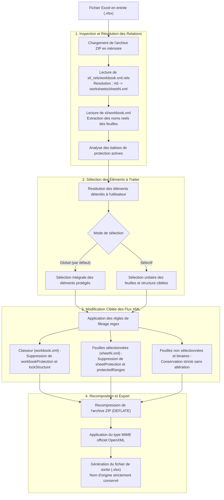

# Documentation Technique - Excel Unlocker

Ce document présente l'architecture, le modèle de données et le fonctionnement interne du système de déverrouillage de classeurs Microsoft Excel (.xlsx, .xlsm).

---

## 1. Architecture et Format OpenXML

Les fichiers Excel modernes (.xlsx, .xlsm, .xltx, .xltm) sont conformes à la norme internationale ISO/IEC 29500 (Office Open XML). Il s'agit de conteneurs compressés au format ZIP renfermant une arborescence de fichiers XML et de fichiers de relations (.rels).

### Structure interne standard d'un classeur :

```text
mon_fichier.xlsx (Archive ZIP)
│
├── [Content_Types].xml               # Déclaration des types MIME des composants internes
├── _rels/.rels                       # Relations globales du package
│
└── xl/                               # Répertoire racine du classeur Excel
    ├── workbook.xml                  # Définition des métadonnées globales et des feuilles
    ├── _rels/
    │   └── workbook.xml.rels         # Table de résolution des identifiants (rId -> chemin XML)
    ├── styles.xml                    # Tables des formats, polices et styles de cellules
    ├── sharedStrings.xml             # Table d'indexation des chaînes textuelles partagées
    └── worksheets/
        ├── sheet1.xml                # Données, structure et protections de la feuille 1
        ├── sheet2.xml                # Données, structure et protections de la feuille 2
        └── ...
```

---

## 2. Diagramme de Flux d'Exécution



---

## 3. Description Détaillée des Étapes de Traitement

### Étape 1 : Cartographie et Résolution des Identifiants (Mapping)
Excel n'indexe pas directement les feuilles par leur nom d'affichage au sein des fichiers XML. Le système effectue une double résolution :
1. Extraction du nœud `<sheet name="NomFeuille" r:id="rIdX" />` dans `xl/workbook.xml`.
2. Résolution de `rIdX` dans `xl/_rels/workbook.xml.rels` pour obtenir le chemin physique cible (`Target="worksheets/sheetN.xml"`).
3. Association formelle entre le libellé utilisateur et le fichier XML correspondant.

### Étape 2 : Détection des Niveaux de Protection

L'analyse inspecte la présence des balises et attributs suivants :

| Périmètre | Composant XML | Balises et Attributs Analysés | Rôle |
| :--- | :--- | :--- | :--- |
| **Feuille de calcul** | `xl/worksheets/sheet*.xml` | `<sheetProtection .../>` | Verrouillage des cellules, lignes, colonnes, filtres |
| **Plages nommées** | `xl/worksheets/sheet*.xml` | `<protectedRanges ...>` | Restrictions sur des plages spécifiques d'utilisateurs |
| **Structure classeur** | `xl/workbook.xml` | `<workbookProtection .../>` | Blocage de l'ajout, suppression, renommage et masquage d'onglets |
| **Attributs classeur** | `xl/workbook.xml` | `lockStructure`, `lockWindows` | Verrouillage structurel et dimensionnel des fenêtres |
| **Partage / Écriture** | `xl/workbook.xml` | `<fileSharing .../>` | Mot de passe de modification et recommandation lecture seule |
| **Feuilles dialogues** | `xl/dialogsheets/sheet*.xml` | `<dialogsheetProtection .../>` | Protection des feuilles de dialogue héritées |

### Étape 3 : Traitement Sélectif et Préservation des Données

- **Composants sélectionnés :** Les balises de protection sont purgées à l'aide d'expressions régulières conformes à la spécification XML. Les formules, formats de cellules, calculs, métadonnées et graphiques sont conservés sans aucune altération.
- **Composants non sélectionnés :** Les flux XML et binaires correspondants sont dupliqués à l'identique, garantissant le maintien de leur chiffrement ou de leur mot de passe d'origine.

### Étape 4 : Recomposition et Remplacement Atomique

1. **Génération de l'archive :** Le flux binaire est recomposé avec un niveau de compression standard DEFLATE et typé avec le format MIME officiel :
   `application/vnd.openxmlformats-officedocument.spreadsheetml.sheet`.
2. **Conservation du nom :** Le fichier généré hérite rigoureusement du nom et de l'extension du fichier source.
3. **Atomicité :** En environnement script (Python/PowerShell), les écritures s'opèrent sur un fichier temporaire suivi d'un remplacement atomique de fichier (`os.replace` / `Move-Item -Force`), prévenant tout risque de corruption en cas d'interruption.

---

## 4. Sécurité et Environnement d'Exécution

- **Absence totale d'exécutable (.exe) :** Le traitement est assuré exclusivement par du code source interprété (JavaScript via les API natives du navigateur, PowerShell avec composants système .NET, ou Python standard).
- **Exécution 100% Locale :** Aucun flux réseau n'est initié. L'intégralité du traitement s'exécute en mémoire vive sur le poste client.
- **Innocuité Antivirus :** L'absence de binaire compilé ou d'injection mémoire évite tout faux-positif lié aux logiciels EDR ou antivirus d'entreprise.
